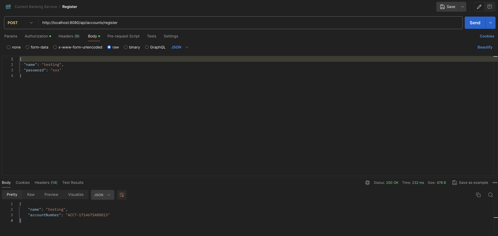
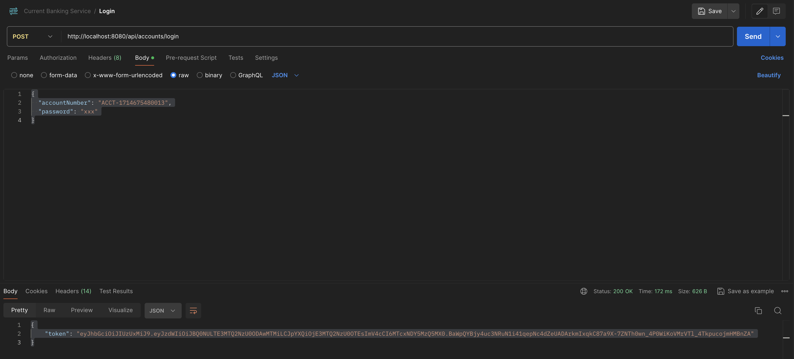
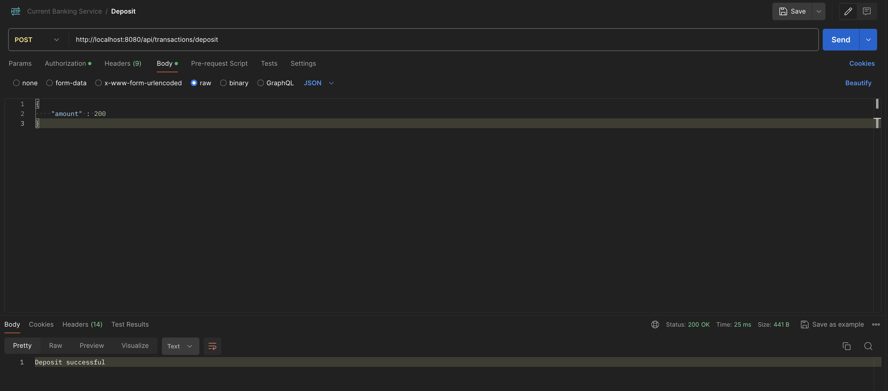
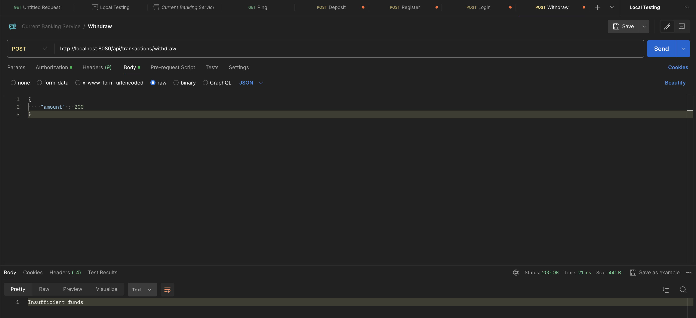
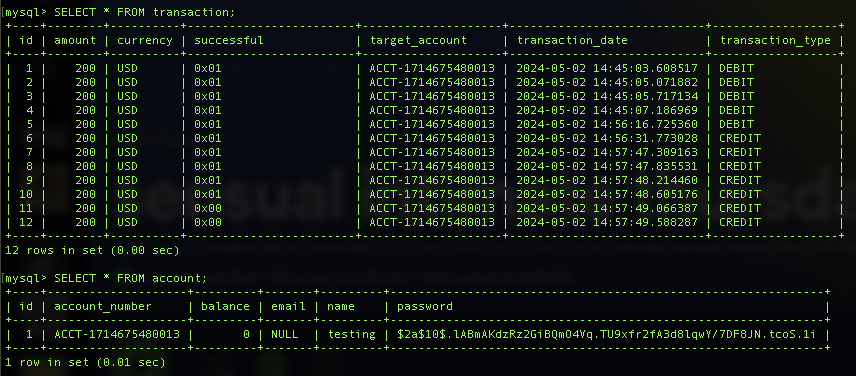

Real-time Transaction
===============================

## Details
The service accepts two types of transactions:
1) Loads: Add money to a user (credit)

2) Authorizations: Conditionally remove money from a user (debit)

Every load or authorization PUT should return the updated balance following the transaction. Authorization declines should be saved, even if they do not impact balance calculation.


## Bootstrap instructions

This section covers the steps required to get the project up and running on your local machine for development and testing purposes.

### Prerequisites

Before proceeding, ensure you have the following installed:
- MySQL.
- **Java JDK 17** or higher: Necessary to run Java applications. You can download it from [Oracle's website](https://www.oracle.com/java/technologies/javase-jdk11-downloads.html) or use OpenJDK.
- **Maven 4.0** or higher: Required for managing the project's build. Download and installation instructions can be found on the [Apache Maven Project website](https://maven.apache.org/).

### Clone the Repository / Open Terminal in the Project Folder
To start, clone the project repository from GitHub to your local machine. 
Alternatively, navigate to the project folder and open a terminal.

```bash
git clone https://github.com/tranhlok/bank-balance.git
cd bank-balance-backend
```

### Configure the MySQL Server

```bash
sudo service mysql start
```

Run the mysql_secure_installation script from the command line. Pick your username and password for the server.
```bash
sudo mysql_secure_installation
```

Open the MySQL shell or MySQL Workbench and create a new database for your project:
```bash
CREATE DATABASE your_database_name;
USE your_database_name;
```
Update your application’s configuration files (application.properties) to point to your MySQL server. 
Replace your_database_name, your_username, and your_password with the previously configured values.
```bash
spring.datasource.url=jdbc:mysql://localhost:3306/your_database_name
spring.datasource.username=your_username
spring.datasource.password=your_password
spring.datasource.driver-class-name=com.mysql.cj.jdbc.Driver
```

### Build the Application
This command also run the unit tests.
```bash
mvn clean install
```

### Run the server
```bash
mvn spring-boot:run
```

## Design considerations


The project is structured as a Spring Boot application, utilizing Maven for dependency management and build configuration (pom.xml). The application is configured with Spring MVC to handle HTTP requests and uses Spring Data JPA for data persistence.

### Main Components
#### Controllers:
- AccountController.java: Manages API requests related to bank accounts such as creating and retrieving accounts.
- TransactionController.java: Handles transactions, including creating and fetching transaction data.
- PingController.java: A simple controller to check the health of the service.
#### Models:
- Account.java: Represents the bank account with attributes like id, balance, and account type.
- Transaction.java: Represents a transaction, detailing attributes such as amount, transaction type, and associated account.
#### Repositories:
- AccountRepository.java: Interface for database operations related to the Account entity.
- TransactionRepository.java: Interface for handling the persistence of Transaction entities.
#### Services:
- AccountService.java and TransactionService.java: These services handle the business logic for account and transaction operations respectively.
#### Security Configuration (Security has its own section below):
- WebSecurityConfig.java: Configures web security, likely managing authentication and authorizing access to various parts of the application.
#### Data Transfer Objects (DTOs):
- LoginRequest.java and UserResponse.java: These classes are used for handling data exchange in user authentication processes.
#### Configuration
- service.yml: Contains application configurations and service definitions, possibly defining properties like server port or database configurations.
#### Key Features
- RESTful API Design: The controllers expose RESTful endpoints for managing accounts and transactions, providing a clear interface for front-end services or external applications.
- Security: Implementation of security protocols to ensure that endpoints are protected against unauthorized access.
- Data Persistence: Utilizes JPA repositories for robust data handling and operations, allowing easy integration with relational databases.

### Security with JSON Web Tokens
The security of the application is managed using Spring Security with JWT (JSON Web Tokens) for authentication and authorization. This ensures secure access to the application's resources.

#### Components
- WebSecurityConfig.java: Configures security settings, including URL access rules, and integrates the JWT authentication filter.
- JwtAuthenticationEntryPoint.java: Handles what happens if authentication fails (for example, returning a 401 unauthorized error to users who try to access a protected resource without credentials). 
- JwtAuthenticationFilter.java: Intercepts requests to read JWTs from headers, validate them, and set up security context if the token is valid. This filter ensures that every secure endpoint is accessed with a valid token.
- JwtTokenUtil.java: Utility class to generate, parse, and validate JWT tokens. It includes methods for extracting username, expiration date from the token, and checking its expiration.
#### Security Flow
- Authentication: When users log in, JwtTokenUtil generates a token that encapsulates user credentials and is returned to the user.
- Authorization: For each request, JwtAuthenticationFilter checks the presence of a valid JWT in the request header, validates it, and allows the request to proceed if the token is valid.
- Exception Handling: JwtAuthenticationEntryPoint handles exceptions when a request lacks a valid authentication token, ensuring that unauthenticated requests do not proceed.
#### Integration
- These components are tightly integrated with the rest of the application, ensuring that security is maintained at all layers and that interactions with critical endpoints such as those handled by AccountController and TransactionController are secure.

### Database Implementation
The application uses Spring Data JPA for managing data persistence, which simplifies the interaction with the database by abstracting boilerplate CRUD operations and providing a more intuitive way of handling data.

#### Overview
- The application uses Spring Data JPA repositories to abstract and encapsulate database access. This allows the service to focus on business logic and service delivery rather than database connectivity and query details.

#### Entities
- Account.java: Represents the account entity with attributes such as account ID, balance, and account type. This class is annotated with JPA annotations to define the table mapping (@Entity), primary key (@Id), and column mappings (@Column).
- Transaction.java: Defines the transaction entity which includes details like transaction amount, type, and the associated account. Similar to Account, this entity is mapped to a database table with appropriate JPA annotations.
Repositories
- AccountRepository.java: Extends JpaRepository, providing CRUD operations for Account entities. It leverages JPA to automatically generate queries based on method names, such as findAll(), findById(), etc.
- TransactionRepository.java: Similar to AccountRepository, it provides automated CRUD operations for Transaction entities, simplifying the management of transaction data.
#### Configuration
- Data Source Configuration: In application.properties, where database connection settings such as URL, username, and password are specified.
- Spring Data Configuration: In CurrentBankingServiceApplication.java or through configuration files, where @EnableJpaRepositories is likely used to enable JPA repository support and @EntityScan to specify the packages to scan for entity classes.
#### Transaction Management
- Spring Data JPA integrates seamlessly with Spring's transaction management. It uses @Transactional annotations to define the scope and boundary of transactions at the repository or service layer, ensuring data consistency and integrity.

#### Benefits
- Reduced Boilerplate Code: Automatic repository implementation significantly reduces the need for explicit SQL.
- Easy to Extend: Adding new entities and repositories can be done with minimal configuration.
- Strong Integration: Works well with other parts of the Spring ecosystem, such as Spring Security and Spring MVC, providing a unified framework experience.

## Tesing with Postman
After initializing the database and maven build, we can go ahead and test the project in Postman

### Register
Register for an account by sending a POST request to url:  http://localhost:8080/api/accounts/login. Send the following in the body, replace name and password
```bash
{
  "name": "testing",
  "password": "xxx"
}
```
It will return an account number if the name is valid, as seen below:
```bash
{
    "name": "testing",
    "accountNumber": "ACCT-1714675480013"
}
```


### Login
Login into an account by sending a POST request to url: http://localhost:8080/api/accounts/login
We can use the account number and name from last request in the body to login, use the same password as before.
```bash
{
  "accountNumber": "ACCT-1714675480013",
  "password": "xxx"
}
```

It will return a bearer token like the following:

```bash
{
"token": "TokenValue"
}
```


### Deposit (DEBIT)
url: http://localhost:8080/api/transactions/deposit .
Add the token above to Authorization -> bearer token in postman. send a simple amount like:
```bash
{
    "amount" : 200
}
```


### Withdraw (CREDIT)
url: http://localhost:8080/api/transactions/deposit .
Add the token above to Authorization -> bearer token in postman. send a simple amount
```bash
{
    "amount" : 200
}
```
it will return Withdrawal successful when there is enough money to execute the command.




### SQL console


## Deployment considerations
- Cloud Hosting Platform: Utilize a major cloud provider like AWS, Azure, or Google Cloud for hosting the application with services tailored to web applications and databases.
- Containerization: Package the application into Docker containers for consistency across development, testing, and production environments.
- Orchestration with Kubernetes: Manage and scale the containerized application automatically using Kubernetes, taking advantage of its load balancing, auto-scaling, and self-healing features.
- CI/CD Pipeline: Implement a CI/CD workflow with Jenkins, GitHub Actions, or GitLab CI to automate building, testing, and deploying the application.
- Monitoring and Logging: Use tools like Prometheus and Grafana for monitoring, and ELK stack or cloud-native solutions for logging, to keep track of the application’s performance and health.
- Security Measures: Ensure all communication is encrypted and manage access using IAM roles, alongside regular updates and security patches to safeguard the application.

## Speical thanks to [Dang Duong](https://github.com/duongdang1)


## ASCII art
```

 (                                     
 )\ )             *   )                
(()/(           ` )  /((      )        
 /(_)) (    (    ( )(_))(  ( /(  (     
(_))   )\   )\  (_(_()|()\ )(_)) )\ )  
| |   ((_) ((_) |_   _|((_|(_)_ _(_/(  
| |__/ _ \/ _|    | | | '_/ _` | ' \)) 
|____\___/\__|    |_| |_| \__,_|_||_|  
                                       
                                                                                                                                                         
```
